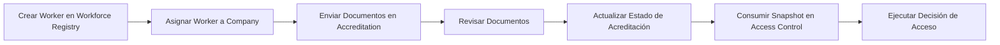
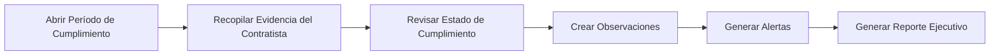
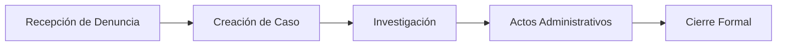

# Flujos Funcionales

## 1. Acreditación de Trabajador hasta Control de Acceso

```mermaid
flowchart LR
    A["Crear Worker en Workforce Registry"] --> B["Asignar Worker a Company"]
    B --> C["Enviar Documentos en Accreditation"]
    C --> D["Revisar Documentos"]
    D --> E["Actualizar Estado de Acreditación"]
    E --> F["Consumir Snapshot en Access Control"]
    F --> G["Ejecutar Decisión de Acceso"]
```

## 2. Cumplimiento Mensual de Contratistas

```mermaid
flowchart LR
    A["Abrir Período de Cumplimiento"] --> B["Recopilar Evidencia del Contratista"]
    B --> C["Revisar Estado de Cumplimiento"]
    C --> D["Crear Observaciones"]
    D --> E["Generar Alertas"]
    E --> F["Generar Reporte Ejecutivo"]
```

## 3. Caso Karin

```mermaid
flowchart LR
    A["Recepción de Denuncia"] --> B["Creación de Caso"]
    B --> C["Investigación"]
    C --> D["Actos Administrativos"]
    D --> E["Cierre Formal"]
```

