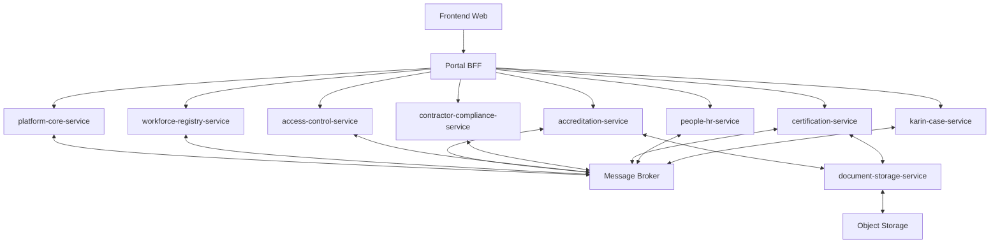

# Vista de Contenedores

## Contenedores

- Frontend Web
- Portal BFF
- Servicios de Negocio
- Servicios Compartidos
- Message Broker
- Object Storage
- Bases de datos por servicio

```mermaid
flowchart TB
    UI["Frontend Web"] --> BFF["Portal BFF"]
    BFF --> CORE["platform-core-service"]
    BFF --> WF["workforce-registry-service"]
    BFF --> ACR["accreditation-service"]
    BFF --> ACS["access-control-service"]
    BFF --> SCC["contractor-compliance-service"]
    BFF --> CERT["certification-service"]
    BFF --> HR["people-hr-service"]
    BFF --> KAR["karin-case-service"]

    CORE <--> MQ["Message Broker"]
    WF <--> MQ
    ACR <--> MQ
    ACS <--> MQ
    SCC <--> MQ
    CERT <--> MQ
    HR <--> MQ
    KAR <--> MQ

    ACR <--> DS["document-storage-service"]
    CERT <--> DS
    DS <--> OBJ["Object Storage"]
```

