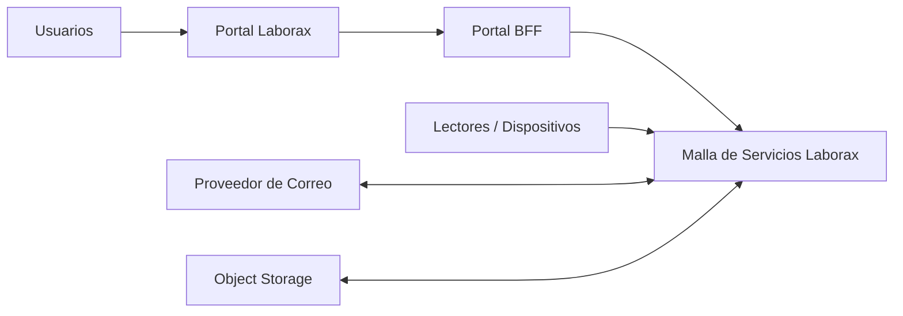

# Contexto del Sistema

## Contexto

Laborax es una plataforma utilizada por personal interno de EAA, empresas clientes, contratistas, auditores, guardias, personal de RRHH y personal legal o investigador.

## Actores y Sistemas Externos

- Usuarios humanos a través del portal web
- Consumidores de servicios internos
- Lectores de credenciales y dispositivos QR
- Proveedores de correo
- Proveedor de object storage
- Sistemas externos adyacentes de identidad si se integran posteriormente

## Diagrama de Contexto

