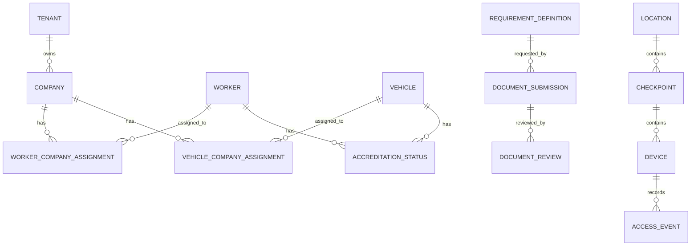

# DER General

```mermaid
erDiagram
    TENANT ||--o{ COMPANY : owns
    COMPANY ||--o{ WORKER_COMPANY_ASSIGNMENT : has
    WORKER ||--o{ WORKER_COMPANY_ASSIGNMENT : assigned_to
    COMPANY ||--o{ VEHICLE_COMPANY_ASSIGNMENT : has
    VEHICLE ||--o{ VEHICLE_COMPANY_ASSIGNMENT : assigned_to
    REQUIREMENT_DEFINITION ||--o{ DOCUMENT_SUBMISSION : requested_by
    DOCUMENT_SUBMISSION ||--o{ DOCUMENT_REVIEW : reviewed_by
    WORKER ||--o{ ACCREDITATION_STATUS : has
    VEHICLE ||--o{ ACCREDITATION_STATUS : has
    LOCATION ||--o{ CHECKPOINT : contains
    CHECKPOINT ||--o{ DEVICE : contains
    DEVICE ||--o{ ACCESS_EVENT : records
```

